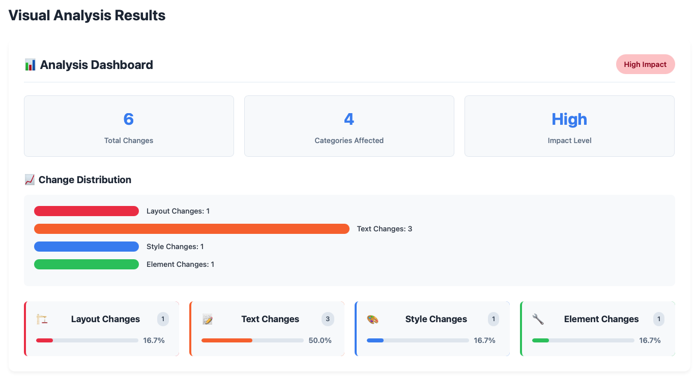

# SmartVisionQA

Prueba de concepto para testing visual automatizado usando modelos de visión locales con Ollama.

## Requisitos

- Python 3.8+
- Ollama instalado y ejecutándose
- Modelo de visión qwen2.5vl:7b descargado

## Instalación

1. Instalar Ollama:
```bash
curl -fsSL https://ollama.ai/install.sh | sh
```

2. Descargar modelo de visión:
```bash
ollama pull qwen2.5vl:7b
```

3. Instalar dependencias Python:
```bash
pip install -r requirements.txt
playwright install chromium
```

## Estructura del Proyecto

```
smartVisionQA/
├── smartVisionQA.py            # Script principal
├── generate_html_report.py     # Generador complejo (legacy)
├── example_url_comparison.py   # Ejemplos de uso con URLs
├── demo/                       # HTMLs de ejemplo
│   ├── page_v1.html           # Versión 1 (original)
│   ├── page_v2.html           # Versión 2 (cambios mayores)
│   ├── page_v3.html           # Versión 3 (cambios menores)
│   └── simple_test.html       # Página de prueba simple
├── results/                    # Capturas y reportes (generado automáticamente)
│   ├── comparison_*.json       # Reportes JSON por comparación
│   ├── visual_report_*.html    # Reportes HTML visuales
│   └── *_screenshot.png        # Capturas de pantalla
└── requirements.txt            # Dependencias
```

## Uso

Ejecutar todas las comparaciones:
```bash
python smartVisionQA.py
```

El script ejecuta automáticamente:
- page_v1.html vs page_v2.html
- page_v1.html vs page_v3.html  
- page_v2.html vs page_v3.html

Para cada comparación:
1. Renderiza los HTMLs a imágenes
2. Usa Ollama para analizar diferencias visuales
3. Genera reporte JSON y HTML únicos

## Personalización

Para comparar otros HTMLs, modificar en `smartVisionQA.py`:

**Aproximadamente línea 300** - Lista de casos de prueba:
```python
test_cases = [
    ("tu_archivo1.html", "tu_archivo2.html"),
]
```

**Línea 59** - Cambiar modelo de Ollama:
```python
def __init__(self, model: str = "qwen2.5vl:7b"): 
```

## Reportes HTML

El sistema genera automáticamente reportes HTML visuales:

```bash
python smartVisionQA.py  # Genera JSON + HTML automáticamente
```

Para generar solo reporte HTML desde JSON existente:
```bash
python generate_simple_report.py results/comparison_page_v1_vs_page_v2.json
```


## Comparar URLs Reales

Para comparar sitios web reales:

```bash
python example_url_comparison.py
```

Puedes modificar las URLs en el archivo `example_url_comparison.py`.

## Extensión

Para integrar con Selenium/Playwright para webs reales:

**En la clase HTMLRenderer (línea 18)**, agregar método:
```python
async def url_to_image(self, url: str) -> bytes:
    # Implementar captura de URL real
    pass
```

## Notas

- Requiere ~6GB para modelo qwen2.5vl:7b
- Primera ejecución descarga modelo (~6GB)
- Capturas guardadas en `results/`